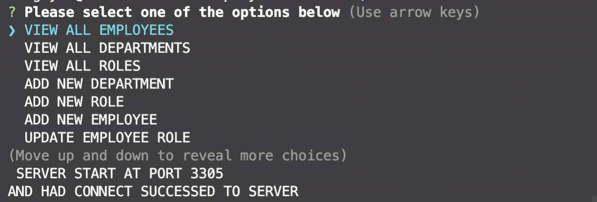
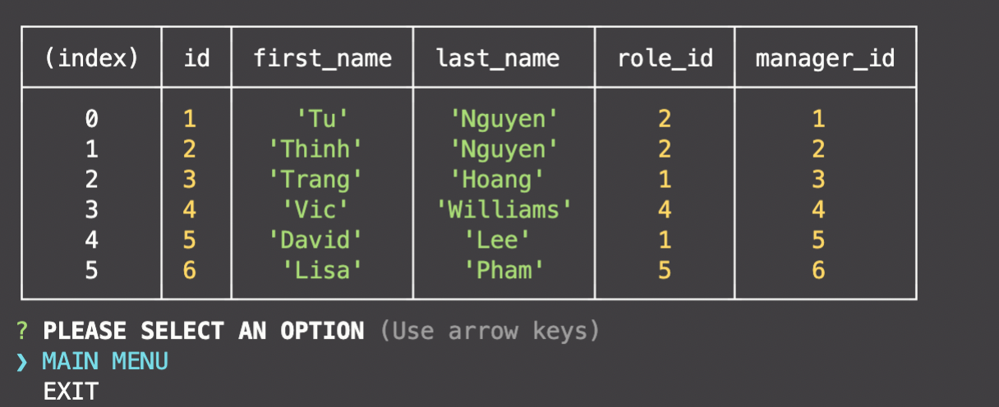
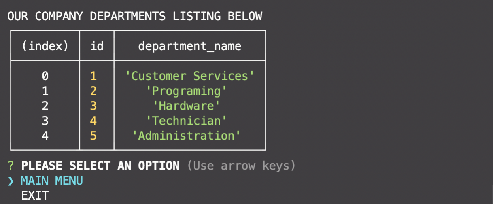
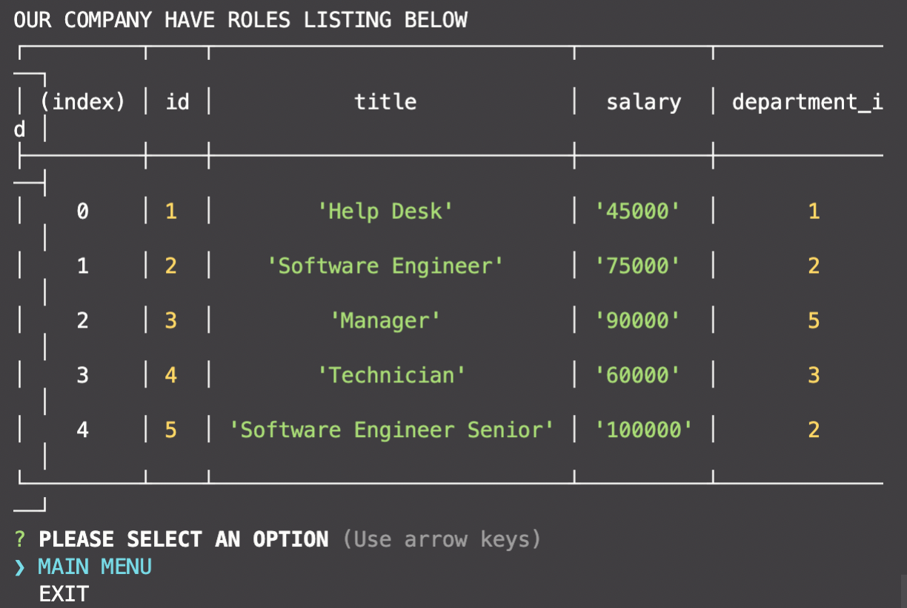

# Employee Tracker

Repo: https://github.com/vi3t4lov3/Employee-Tracker-SQL

## Description
Developers frequently have to create interfaces that allow non-developers to easily view and interact with information stored in databases.

Build a command-line application from scratch to manage a company's employee database, using Node.js, Inquirer, and MySQL.

## Table of Contents

- [Employee Tracker](#employee-tracker)
  - [Description](#description)
  - [Table of Contents](#table-of-contents)
  - [Dependencies](#dependencies)
  - [Installation](#installation)
  - [Usage](#usage)
  - [Contribute](#contribute)
  - [Tests](#tests)
  - [Demo](#demo)
  - [Questions](#questions)
  - [License](#license)

## Dependencies

- HTML
- CSS
- Javascript (OOP, Node.js, ExpressJS, MySQL)

## Installation

You can run a local copy of this site by issuing the following commands.

```bash
$ git clone https://github.com/vi3t4lov3/Employee-Tracker-SQL.git
$ cd Employee-Tracker-SQL
$ Dont forget to run SOURCE schema.sql & seeds.sql in db folder
$ run npm init 
$ npm node .
```

## Usage

```md
GIVEN a command-line application that accepts user input
WHEN I start the application
THEN I am presented with the following options: view all departments, view all roles, view all employees, add a department, add a role, add an employee, and update an employee role
WHEN I choose to view all departments
THEN I am presented with a formatted table showing department names and department ids
WHEN I choose to view all roles
THEN I am presented with the job title, role id, the department that role belongs to, and the salary for that role
WHEN I choose to view all employees
THEN I am presented with a formatted table showing employee data, including employee ids, first names, last names, job titles, departments, salaries, and managers that the employees report to
WHEN I choose to add a department
THEN I am prompted to enter the name of the department and that department is added to the database
WHEN I choose to add a role
THEN I am prompted to enter the name, salary, and department for the role and that role is added to the database
WHEN I choose to add an employee
THEN I am prompted to enter the employee’s first name, last name, role, and manager, and that employee is added to the database
WHEN I choose to update an employee role
THEN I am prompted to select an employee to update and their new role and this information is updated in the database 
```

## Contribute

1. Fork it
2. Create your feature branch (`git checkout -b my-new-feature`)
3. Commit your changes (`git commit -am 'Add some feature'`)
4. Push to the branch (`git push origin my-new-feature`)
5. Create new Pull Request

## Tests

```
NO TEST THIS TIME
```

## Demo


[Click here] (https://www.youtube.com/watch?v=UIhtvwJXsDs) 









## Questions

If you have questions about this repository reach me by Github: [vi3t4lov3](https://github.com/vi3t4lov3)
or send an email: tuinfor@ymail.com

## License

[](https://opensource.org/licenses/MIT)
